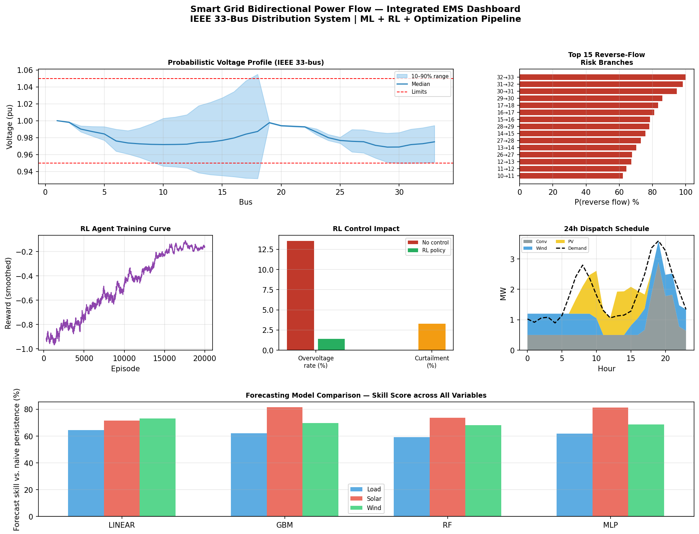
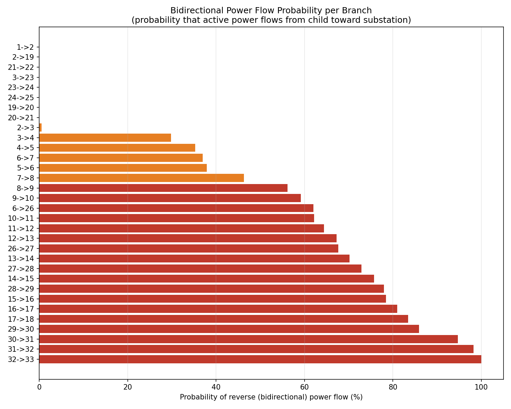
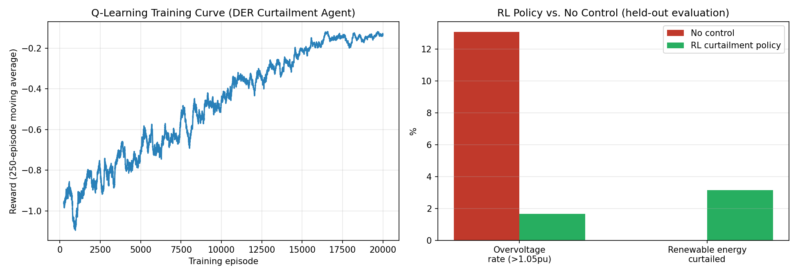

# Smart Grid EMS — RL Control & Safe Operation Under Partial Observability

### Probabilistic Analysis · ML Forecasting · RL Control · Economic Dispatch

[](https://python.org)
[](https://ieeexplore.ieee.org)
[](https://data.open-power-system-data.org)
[](LICENSE)

---

## What This Project Does

When solar panels and wind turbines generate more power than local demand, electricity flows **backward** — from homes toward the substation. This project quantifies that risk, predicts when it will happen, and automatically controls it — and then studies *how the learned controller fails* when a safety-relevant variable is hidden from it.

**Five integrated modules, one executable pipeline:**

```
Real OPSD Data  →  Probabilistic Forecast  →  Monte Carlo Power Flow
                                                        ↓
                Economic Dispatch  ←  RL Voltage Control  ←  Bidirectional Flow Risk
```

---

## Key Results

| Module                 | Result                                                                          |
| ---------------------- | ------------------------------------------------------------------------------- |
| **Bidirectional flow** | 23 of 32 branches show reverse flow under high DER penetration                   |
| **ML surrogate**       | Random Forest: 3.3×10⁻⁴ pu RMSE — same order of magnitude as published surrogates |
| **RL control**         | Overvoltage 12.7% → 1.6% **at the training load** — fails silently off-distribution (see below) |
| **Solar forecasting**  | GBM: **85.1% skill** improvement over naive persistence (real OPSD data)         |
| **Economic dispatch**  | LP optimizer: 70%+ RE share, ramp/reserve/storage constraints                   |

---

## Robustness Analysis — Silent Failure Under Partial Observability

The RL agent's state is the discretized (wind, PV) output. **Load is not in the state.**
Two controlled experiments test what that omission costs.

### Experiment 1 — Distribution shift

The agent is trained at nominal load, then evaluated under load levels it never
saw. Reported over 5 training seeds × 5 evaluation seeds (overvoltage rate, >1.05 pu).

| Load factor      | No control      | RL policy       |
| ---------------- | --------------- | --------------- |
| x0.5 (low)       | 33.2% ± 1.5     | **33.2% ± 1.5** |
| x1.0 (nominal)   | 12.7% ± 1.0     | 1.6% ± 0.3      |
| x1.5 (high)      | 0.0%            | 0.0%            |
| x2.0 (very high) | 0.0%            | 0.0%            |

**Finding:** at its training load the agent removes almost all overvoltage
(12.7% → 1.6%). At half load it is **indistinguishable from no control**. Because
load is absent from its state, it cannot perceive the dangerous low-load regime and
keeps applying the curtailment it learned for nominal load — a silent failure, with
no drop in its own reward/value estimate to warn it.

### Experiment 2 — Is it the missing observation, or an unsolvable task?

Both agents are trained on the **same** varying-load distribution
(load factor ∈ [0.5, 2.0] sampled per episode). The only difference: one observes
load (FO), the other does not (PO). Reported over 3 seeds.

| Load factor    | No control | PO (blind to load) | FO (observes load) |
| -------------- | ---------- | ------------------ | ------------------ |
| x0.5           | 32.5%      | 31.2%              | **13.5%**          |
| x1.0           | 12.5%      | 0.0%               | 0.0%               |

**Finding:** even after seeing these loads in training, the blind agent still fails
at low load (31.2% ≈ no control), while the agent that observes load roughly halves
the violations (13.5%). This isolates the cause as **state aliasing from partial
observability** — not an unsolvable task. The residual 13.5% reflects a physical
limit of curtailment as the sole control lever (extreme reverse flow needs a second
lever, e.g. reactive power or storage).

Reproduce: `python experiment_distribution_shift.py` and
`python experiment_partial_observability.py`.

---

## Current Research Extension

These experiments reproduce, in a small and fully inspectable setting, a failure mode
that is **well known in the POMDP / safe-RL literature**: a policy can be optimal
under its observation distribution while silently violating safety constraints under
the true state distribution, with no signal in its own value estimates.

The contribution here is not the phenomenon itself but a clean, controlled *model
organism* of it, plus the question that follows:

- **Detection.** Can an internal signal flag the dangerous regime earlier than the
  model's own (uninformative) confidence?
- **Transfer.** Does the same phenomenon — and the same detection approach — carry
  over to LLM-based agents acting under partial context?

This connects directly to specification gaming, distribution shift, and monitoring /
AI control.

---

## Selected Figures

### Integrated EMS Dashboard


### Bidirectional Flow Risk Map


### RL Training & Control Impact


---

## Architecture

```
sgbpf/
├── src/
│   ├── network.py               # IEEE 33-bus data + BFS power flow solver
│   ├── der_models.py            # Weibull wind / Beta-irradiance PV models
│   ├── monte_carlo.py           # LHS Monte Carlo probabilistic power flow
│   ├── advanced_forecasting.py  # Quantile regression forecaster (4 models)
│   ├── surrogate.py             # ML surrogate power-flow model
│   ├── rl_control.py            # Q-learning DER curtailment agent
│   ├── economic_dispatch.py     # Day-ahead LP economic dispatch
│   ├── data_loader.py           # OPSD real data loader + literature baselines
│   ├── pipeline.py              # End-to-end integration
│   └── dashboard.py             # All figure generation
├── test_network.py                     # pytest regression tests vs Baran & Wu (1989)
├── experiment_distribution_shift.py    # silent failure under load shift
├── experiment_partial_observability.py # FO vs PO — isolates the cause
├── main.py                      # Run everything
└── requirements.txt
```

---

## Methodology

### 1. Power Flow Engine
Backward/Forward Sweep (BFS) solver on the **IEEE 33-bus radial distribution test system** (Baran & Wu, 1989).
Validated: V_min = 0.9131 pu at bus 18, losses = 202.68 kW ✓ (checked in `test_network.py`).

### 2. Probabilistic Power Flow
- 3000 Monte Carlo scenarios with Latin Hypercube Sampling
- Wind: Weibull(k=2.0, c=8.0) → 3-segment turbine curve
- Solar: Beta(α=2.5, β=1.5) → temperature-corrected PV model
- DER: 2000 kW wind at bus 18, 1800 kW PV at bus 33

### 3. Probabilistic Forecasting
- **Real data**: OPSD Germany 2017–2018 (load, wind, solar)
- Features: Fourier harmonics, lag-24h, rolling statistics
- Quantile regression → 80% prediction intervals
- Gaussian copula for correlated wind-solar scenario generation

### 4. ML Surrogate Model

Internal benchmark — all three models trained and tested on the **same**
BFS-generated dataset (IEEE 33-bus, fixed topology):

| Model             | RMSE (pu)   | Speed (μs/sample) |
| ----------------- | ----------- | ----------------- |
| Linear Regression | 0.00464     | 0.75              |
| **Random Forest** | **0.00033** | 57.7              |
| MLP (neural net)  | 0.00157     | 2.35              |
| Full BFS solver   | —           | ~1000             |

> The surrogate approximates a **deterministic** solver on a **fixed** topology, so
> low in-distribution RMSE is expected and is not itself the headline. The meaningful
> gains are the ~Nx speed-up over the full solver and, for future work, generalization
> to unseen DER configurations.

### 5. RL Curtailment Control
- Tabular Q-learning, 64 states (8×8 wind × PV); single-step (γ = 0, contextual-bandit) formulation
- Actions: curtailment fraction {0%, 15%, 30%, 45%, 60%, 80%}
- 20,000 training episodes
- Robustness / partial-observability analysis: see above

### 6. Economic Dispatch
- Linear program (HiGHS solver), 192 variables (8 types × 24 hours)
- Ramp-rate limits, 10% spinning reserve, battery SoC dynamics

---

## Quick Start

```bash
git clone https://github.com/saba-aslani/smart-grid-bidirectional-power-flow.git
cd smart-grid-bidirectional-power-flow
pip install -r requirements.txt

# Optional: add real OPSD data
# Download time_series_60min_singleindex.csv from:
# https://data.open-power-system-data.org/time_series/2019-06-05/
# Place in: data/

python main.py                              # full pipeline (9 figures -> results/)
pytest test_network.py -v                   # solver regression tests
python experiment_partial_observability.py  # FO vs PO silent-failure study
```

---

## Requirements

```
numpy · scipy · pandas · scikit-learn · matplotlib · networkx · seaborn · pytest
```

No GPU required. Python 3.9–3.13.

---

## Literature Context (Surrogate Accuracy)

For reference, surrogate / approximation methods report voltage errors on the order
of 10⁻³–10⁻⁴ pu — Su (2005) ≈ 2.1×10⁻³, Mohammadi et al. (2018) ≈ 1.2×10⁻³,
Yang et al. (2020, deep NN) ≈ 4×10⁻⁴. The Random Forest result here is the same order
of magnitude, but these figures are from **different test systems and setups and are
not directly comparable** — no superiority is claimed.

---

## Author

**Saba Aslani** — Independent Researcher, Vancouver, BC, Canada
Electrical Engineering · Data Engineering · Smart Grid Systems

---

## License

MIT — free to use with attribution.
